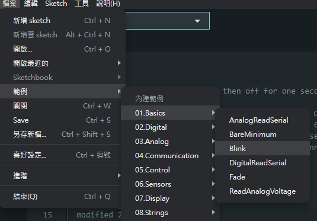
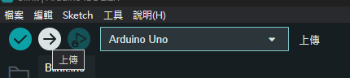
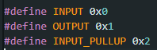

# 使用 Arduino 內建的範例程式

Arduino IDE 內有內建一些基礎的範例程式，這些程式可以幫助初學者快速的進入狀況，其中初學者最常使用的不外乎是 `Blink` 範例的，這個範例很簡單，可以讓 `LED_BUILTIN` 每間隔一秒亮滅(LED_BUILTIN 在每個開發版中不竟相同，Uno 版為 `13` 腳位)



點開上面的範例後，我們們可以看到底下已經出現了以下內容:

```cpp
/*
  Blink

  Turns an LED on for one second, then off for one second, repeatedly.

  Most Arduinos have an on-board LED you can control. On the UNO, MEGA and ZERO
  it is attached to digital pin 13, on MKR1000 on pin 6. LED_BUILTIN is set to
  the correct LED pin independent of which board is used.
  If you want to know what pin the on-board LED is connected to on your Arduino
  model, check the Technical Specs of your board at:
  https://www.arduino.cc/en/Main/Products

  modified 8 May 2014
  by Scott Fitzgerald
  modified 2 Sep 2016
  by Arturo Guadalupi
  modified 8 Sep 2016
  by Colby Newman

  This example code is in the public domain.

  https://www.arduino.cc/en/Tutorial/BuiltInExamples/Blink
*/

// the setup function runs once when you press reset or power the board
void setup() {
  // initialize digital pin LED_BUILTIN as an output.
  pinMode(LED_BUILTIN, OUTPUT);
}

// the loop function runs over and over again forever
void loop() {
  digitalWrite(LED_BUILTIN, HIGH);  // turn the LED on (HIGH is the voltage level)
  delay(1000);                      // wait for a second
  digitalWrite(LED_BUILTIN, LOW);   // turn the LED off by making the voltage LOW
  delay(1000);                      // wait for a second
}
```

如果你有一定的英文基礎，可以是這看看上面的註解，註解上大致描述了該程式的功能及運作邏輯。註解的功能就是這樣，能夠提醒其他開發者或者自己這邊所寫的功能是甚麼。接下來我們將該串程式燒入(上傳)到 Arduino 開發版上看看效果。



點選左上角的 `上傳` 按鈕，這樣程式就會進行編譯在上傳至開發版上。上傳完畢後我們可以看到 Arduino Uno 版上有一個 LED 燈在以 1 秒個間隔亮/滅。

## Blink 原理解說

那麼這段程式是如何完成以下工作的呢?其實很簡單，我們可以看到有當前有兩個函數(function)在程式中，一個是 `void setup()` 另一個是 `void loop()` 其中 `void setup()` 是初始化，它會在 IC 開啟時執行，而 `void loop()` 會持續運行。如果拆解成單組可等同於: (以下程式僅為示義)

```cpp
/* 初始化程式 */

while (true) {
  /* loop 程式 */
}
```

看完函數後，我們再來看看函數內有什麼? setup 函數中裡面呼叫了 `pinMode(LED_BUILTIN, OUTPUT);`，`pinMode` 又是甚麼?

### pinMode -> 腳位模式

```cpp
void pinMode(uint8_t pin, uint8_t mode)
```

pinMode 中文翻譯為 腳位模式，顧名思義這個函數和腳位的模式有關，他可以設定 pin(腳位) 的 mode(模式)，其中常見的腳位模式有可分為:

- `INPUT`[0x0]: 輸入
- `OUTPUT`[0x1]: 輸出
- `INPUT_PULL`[0x2]: 上拉輸入

其中輸入及輸出很好理解，而上拉輸入我會在後面再面的課程中再作解釋。下圖為 Arduino 內的模式宣告。


