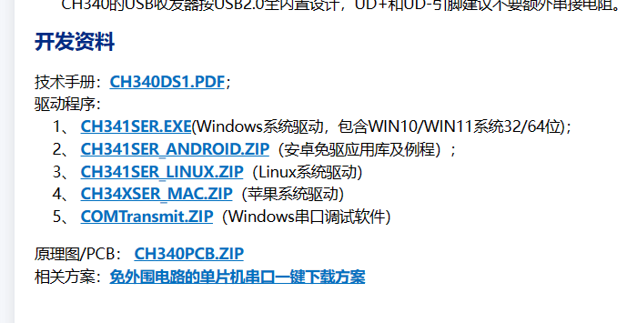
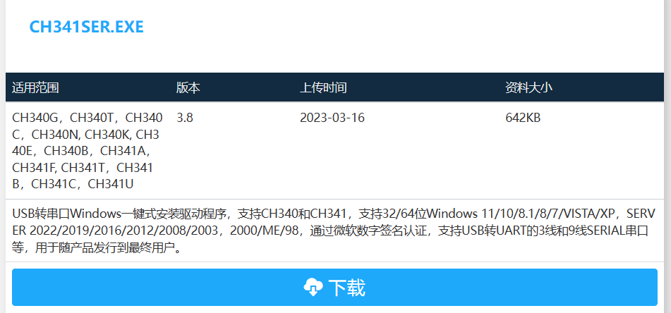
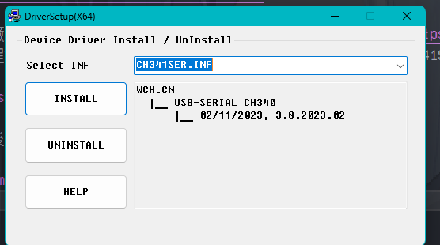

# 建置開發環境

## 如何安裝副廠驅動

### [CH340](https://www.wch.cn/products/CH340.html)

CH340 是絕大多數副廠所使用的 IC，故我們需要安裝 CH340 的驅動打開[官網](https://www.wch.cn/products/CH340.html)往下滑就可以看到 `开发资料` 裡的驅動程式，打開你對應的版本我所使用的 windows 系統故安裝 CH341SER.EXE (直接點擊藍標即可)。

點擊`下载`，下載完畢後開啟

點擊 `Install` 等他跑完就可已關掉了

