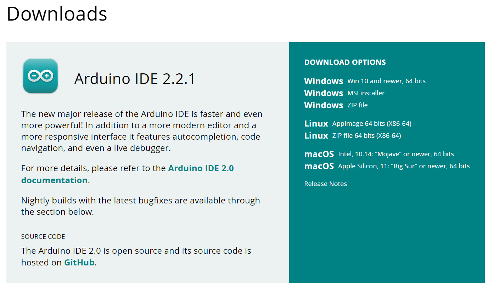
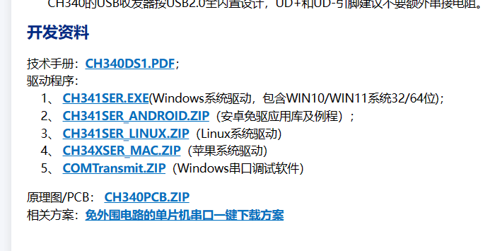
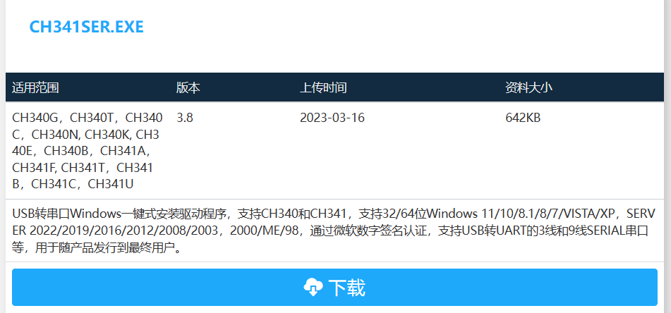
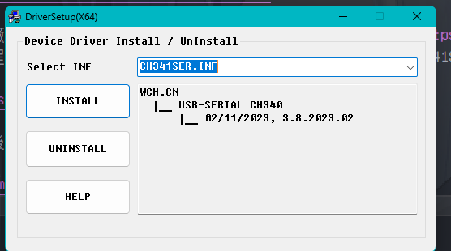

# 建置開發環境

我相信看到這邊的人手邊都有一張 Arduino 開發版了，接下來來正式的進入 Arduino 的世界吧!!

## 如何安裝整合開發環境

整合開發環境(IDE)是甚麼?整合開發環境是一種輔助程式開發人員開發軟體的應用軟體，在開發工具內部就可以輔助編寫原始碼文字、並編譯打包成為可用的程式，有些甚至可以設計圖形介面。 IDE通常包括程式語言編輯器、自動構建工具、通常還包括除錯器。

Arduino 官方有出自己的 IDEA 提供給使用者使用，[下載連結](https://www.arduino.cc/en/software)。我們點開後往下滑可以看到 `Arduino IDE 某某某版本`，我推薦下載 2.x.x 以上版本，如果你不太熟悉 Arduino 所提供的函數或是

## 如何安裝副廠驅動

### [CH340](https://www.wch.cn/products/CH340.html)

CH340 是絕大多數副廠所使用的 IC，故我們需要安裝 CH340 的驅動打開[官網](https://www.wch.cn/products/CH340.html)往下滑就可以看到 `开发资料` 裡的驅動程式，打開你對應的版本我所使用的 windows 系統故安裝 CH341SER.EXE (直接點擊藍標即可)。

點擊`下载`，下載完畢後開啟

點擊 `Install` 等他跑完就可已關掉了

---

::: details 參考資料

1. [整合開發環境](https://zh.wikipedia.org/zh-tw/%E9%9B%86%E6%88%90%E5%BC%80%E5%8F%91%E7%8E%AF%E5%A2%83)

:::
