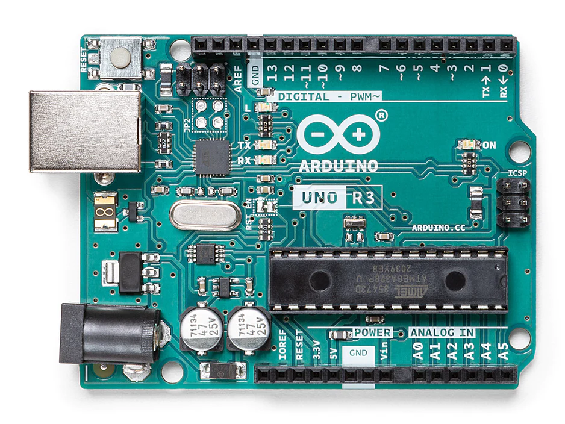
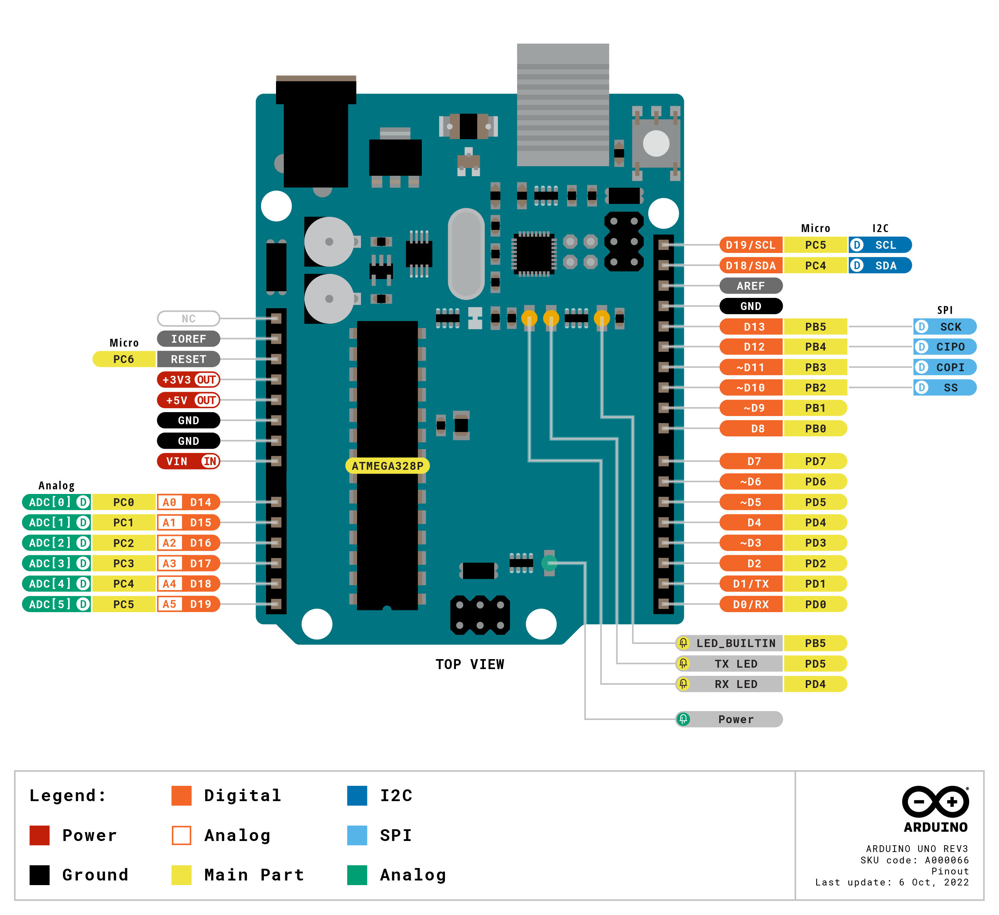
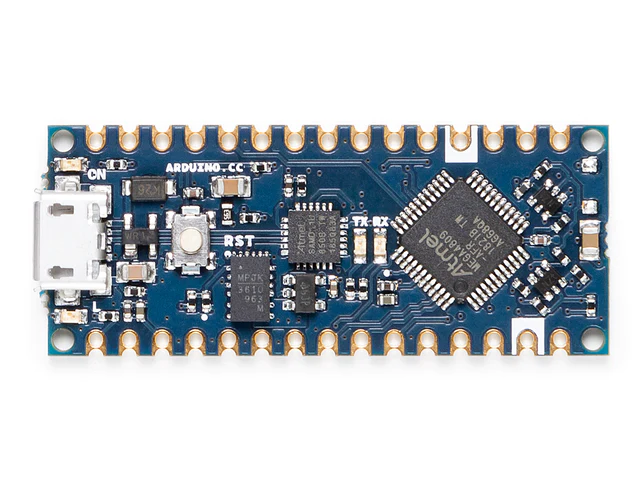
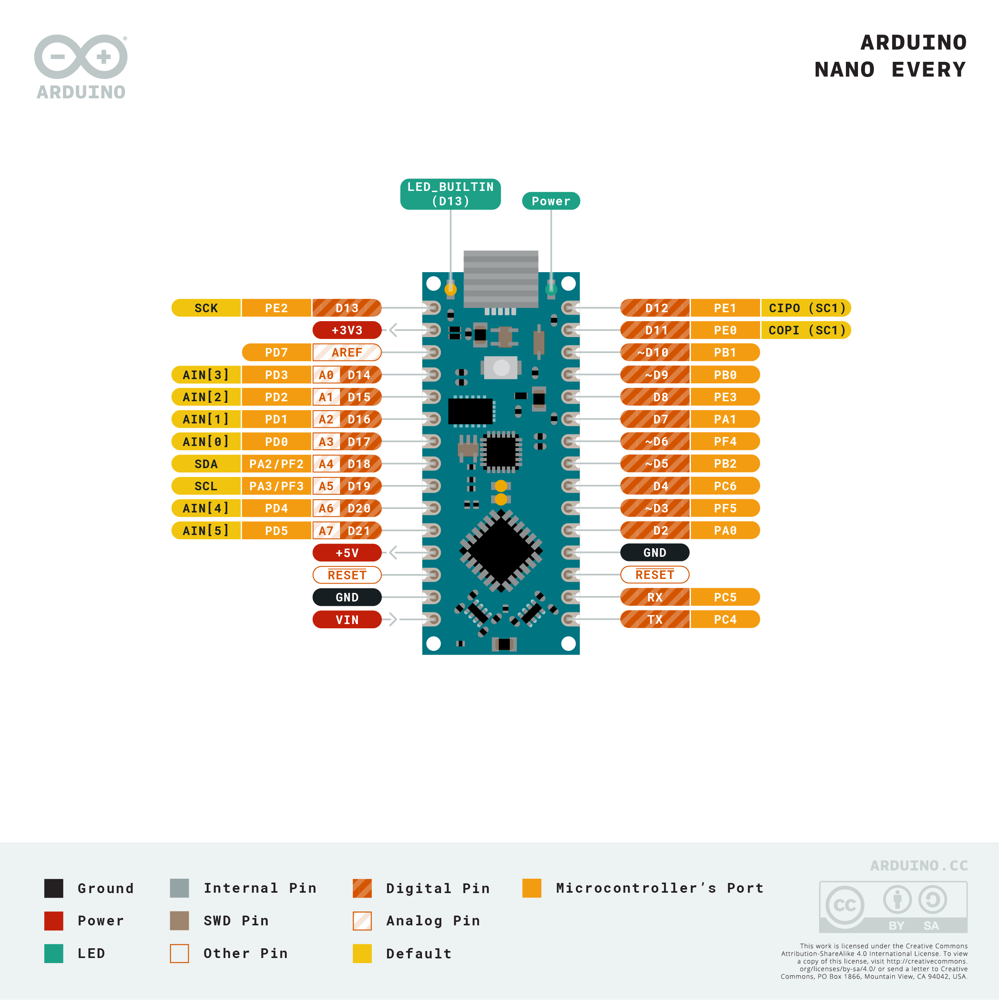

# Arduino 是什麼?

Arduino 是一個開源嵌入式硬體平台，它於 2005 年面世使後來的嵌入式開發可以更為的簡單及快速。相比之前的單晶片，他大幅的降低了學習成本，用小小的體積將控制 IC 及燒錄功能整合在一塊板子上並且能夠配合麵本板，輕鬆的接上各式感測器及設備，除了硬體 Arduino 還給予了開發者完整的開發文檔，並添加更為簡易的函數調用方法，使軟體開發更為簡易。

## Arduino 的魅力

Arduino 有這大量的社群開發經驗，代表了他有大量的第三方函數庫及大量的教學，讓控制不同的感測器可以不用再深入的了解底層的通訊及原理，使開發者不用深入了了解設備的技術細節，只需專注於他的專案開發即可。

同時 Arduino 使用創用 CC 授權，不主張專利，任何人都允許生產印刷電路板的複製品，還能重新設計，甚至銷售原設計的複製品中間無須取得 Arduino 團隊了許可。也因此，原本的正版板子原本可能 600~800 塊，若負擔不起也可以購買副廠的板子，只要不到 200 塊就可以買到。

## 常用 Arduino 開發板

Arduino 的開發板非常多，除了官方的，還有不少副廠設計的開發版，最常用的開發板不外乎 `Arduino Uno`、`Arduino Nano` 及 `Arduino Mega` 等。

> 以下數據參考 [Arduino Hardware](https://www.arduino.cc/en/hardware)

### Arduino Uno

新手最常使用的 Arduino 開發版，有 14 個 digital I/O (數位 I/O)引腳，其中有 6 個 PWM digital I/O 接腳，並有 6 個 analog I/O 接腳，可以滿足大部分測試及開發需求。

### Arduino Nano Every

比 Arduino Uno 的體積還小，能夠壓縮更多的硬體體積(若需要更小的體積可以直接使用 Arduino Nano 的底層 IC (ATMega4809) 或者其它 IC)。

| 類型              | 參數                    |
| ----------------- | ----------------------- |
| Microcontroller   | ATMega4809 (datasheet)  |
| EEPROM            | 256byte (ATMega4809)    |
| PWM Pins          | 5 (D3, D5, D6, D9, D10) |
| Analog Input Pins | 8 (ADC 10 bit)          |

