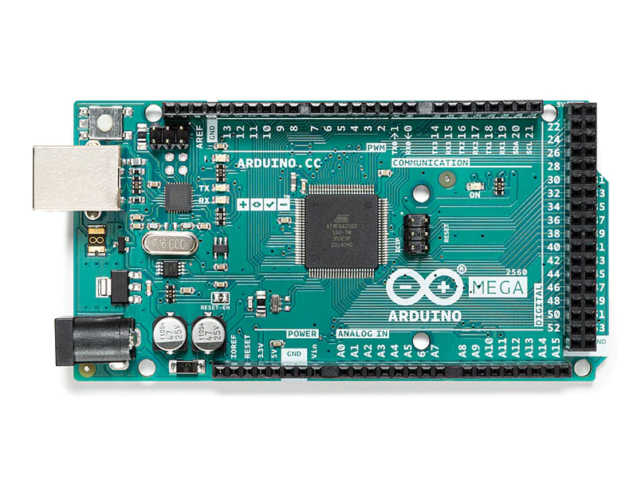
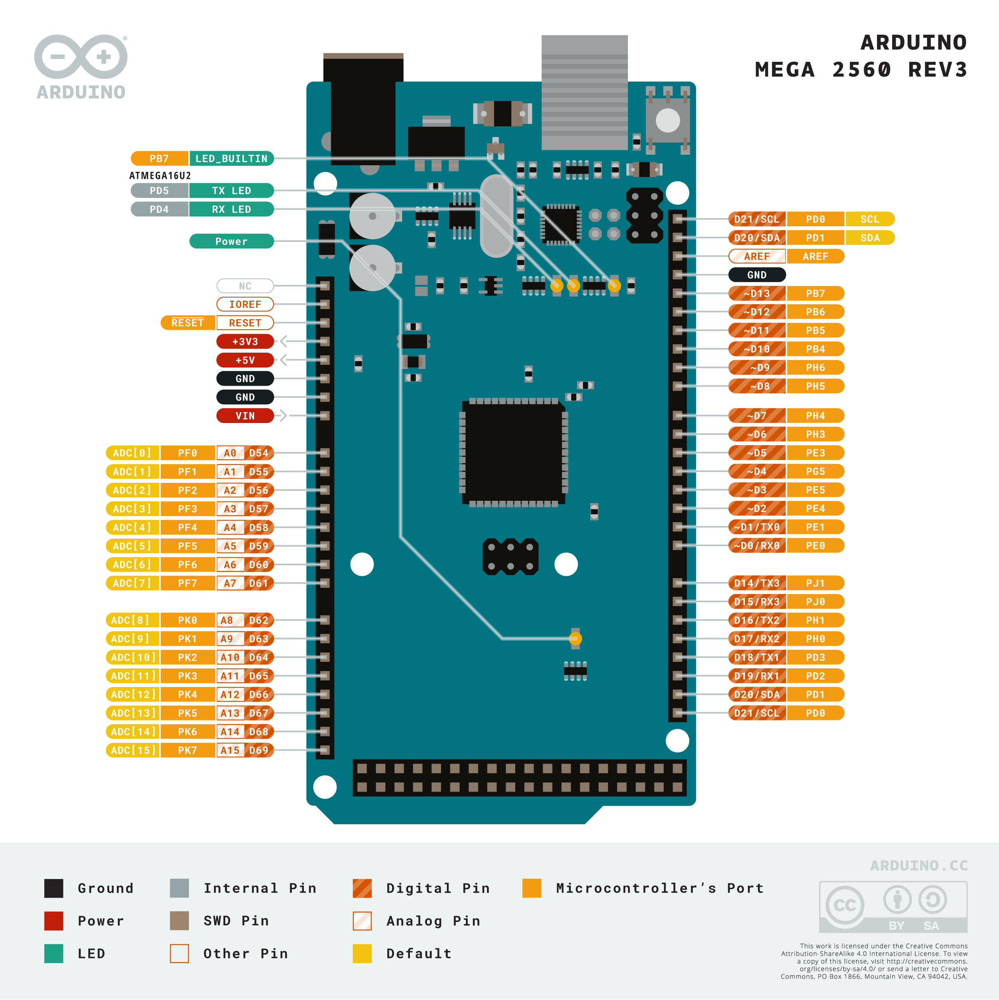

# Arduino 是什麼?

Arduino 是一個開源嵌入式硬體平台，它於 2005 年面世使後來的嵌入式開發可以更為的簡單及快速。相比之前的單晶片，他大幅的降低了學習成本，用小小的體積將控制 IC 及燒錄功能整合在一塊板子上並且能夠配合麵本板，輕鬆的接上各式感測器及設備，除了硬體 Arduino 還給予了開發者完整的開發文檔，並添加更為簡易的函數調用方法，使軟體開發更為簡易。

## Arduino 的魅力

Arduino 有這大量的社群開發經驗，代表了他有大量的第三方函數庫及大量的教學，讓控制不同的感測器可以不用再深入的了解底層的通訊及原理，使開發者不用深入了了解設備的技術細節，只需專注於他的專案開發即可。

同時 Arduino 使用創用 CC 授權，不主張專利，任何人都允許生產印刷電路板的複製品，還能重新設計，甚至銷售原設計的複製品中間無須取得 Arduino 團隊了許可。也因此，原本的正版板子原本可能 600~800 塊，若負擔不起也可以購買副廠的板子，只要不到 200 塊就可以買到。

## 常用 Arduino 開發板

Arduino 的開發板非常多，除了官方的，還有不少副廠設計的開發版，最常用的開發板不外乎 `Arduino Uno`、`Arduino Nano` 及 `Arduino Mega` 等。

### [Arduino Uno](https://store.arduino.cc/products/arduino-uno-rev3)

新手最常使用的 Arduino 開發版，有 14 個 digital I/O (數位 I/O)引腳，其中有 6 個 PWM digital I/O 接腳，並有 6 個 analog I/O 接腳，可以滿足大部分測試及開發需求。

| 類型                | 參數                                |
| ------------------- | ----------------------------------- |
| Microcontroller     | ATmega328P                          |
| Digital I/O Pins    | 14 (of which 6 provide PWM output)  |
| PWM Pins            | 6 (3, 5, 6, 9, 10, 11)              |
| Analog Input Pins   | 6                                   |
| EEPROM              | 1 KB (ATmega328P)                   |
| External Interrupts | 2, 3 (use attachInterrupt function) |

::: details 腳位說明及外觀
 

:::

### [Arduino Nano Every](https://store.arduino.cc/products/arduino-nano-every)

比 Arduino Uno 的體積還小，能夠壓縮更多的硬體體積(若需要更小的體積可以直接使用 Arduino Nano 的底層 IC (ATMega4809) 或者其它 IC)。

| 類型                | 參數                    |
| ------------------- | ----------------------- |
| Microcontroller     | ATMega4809              |
| PWM Pins            | 5 (D3, D5, D6, D9, D10) |
| Analog Input Pins   | 8 (ADC 10 bit)          |
| EEPROM              | 256byte (ATMega4809)    |
| External Interrupts | All digital pins        |

::: details 腳位說明及外觀
 

:::

### [Arduino Mega 2560](https://store.arduino.cc/products/arduino-mega-2560-rev3)

覺得原本的開發版腳位不夠了?可以試試 `Arduino Mega 2560`，添加了更多的接腳，其它部分基本除了大一點和貴一點和 Arduino Uno 版並無太大的差別。

| 類型                | 參數                                                                                                     |
| ------------------- | -------------------------------------------------------------------------------------------------------- |
| Microcontroller     | ATmega2560                                                                                               |
| Digital I/O Pins    | 54 (of which 15 provide PWM output)                                                                      |
| PWM Pins            | 15 (2 to 13 and 44 to 46)                                                                                |
| Analog Input Pins   | 16                                                                                                       |
| EEPROM              | 4 KB                                                                                                     |
| External Interrupts | 2 (interrupt 0), 3 (interrupt 1), 18 (interrupt 5), 19 (interrupt 4), 20 (interrupt 3), 21 (interrupt 2) |

::: details 腳位說明及外觀
 

:::

## 正版 & 副廠

市面上看到的板子，絕大多數都是副廠的，也應為這樣大幅的降低了入門的門檻(錢錢不夠深 😦)，副廠和正版的板子基本沒有太大的差別，不過有些副廠的板子由於使用和正版不同的 USB 轉換 IC，在安裝 Arduino IDE 時不會自動安裝該驅動，需要自行安裝驅動，驅動安裝方法可以在[這邊](./setup.md)看到。

---

::: details 參考資料

1. [Arduino Hardware](https://www.arduino.cc/en/hardware)

:::
